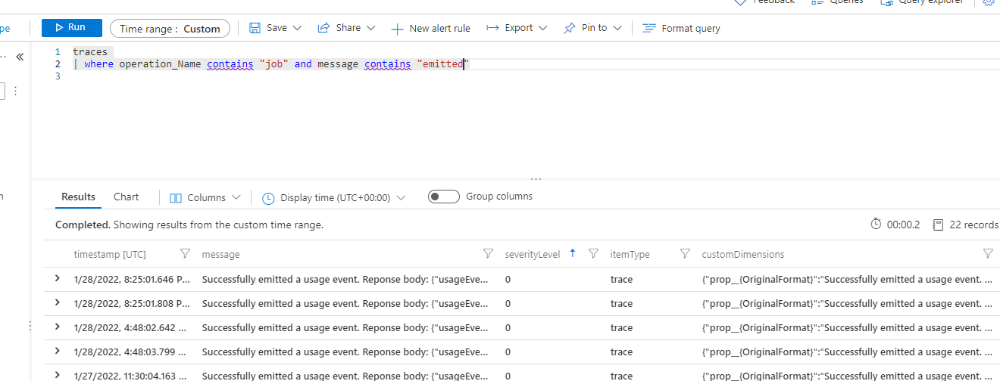

# Deploy  Azure Marketplace Managed-App with built-in Custom billing Meter:

This demo shows how to deploy Managed App with Function app to  emit meter usage events to marketplace using **predefined dimensions and quantities** in code.

## Design
The following diagrm shows the overall workflow for this demo


## Custom billing Senario

This demo shows how to implement a **recurring fix fee billing** that happening once the managed resources are created using Azure function timer crobjob.


## Important Configuration
ARM template expects the following configuration

1. <b>_artifactsLocation</b> ARM template will deploy function from a Zip file so it is expected to pass the location of the zip file using this `_artifactsLocation` parameter

1. <b>_artifactsLocationSasToken</b> It is optional and only required if accessing the function zip file require a token

1. <b>DIMENSION_CONFIG</b> predefined dimensions and quantities that the function will use to emit usage event to Azure marketplace


1. ARM using resource type `Microsoft.Resources/deployments` 

In order to pass the Partner center validation you need to update the resource name with the Custerom PID Guid from PartnerCenter


1. ARM Template will deploy function using `WEBSITE_RUN_FROM_PACKAGE` and expecting `functionpackage.zip` to place under `artifacts` folder.


## Installation from Partner Center Preview

1. Use the contents of the `/function/ama-custom-billing-msi-timer/arm` folder to create a ZIP file for your plan in Partner Center.
1. Upload the ZIP file to the Technical Configuration page of the Azure Managed Application plan in Partner Center.
1. Publish the plan. It will take some time for the plan to reach Preview stage.
1. From Preview, purchase the plan. 
    - Do not purchase the plan from the same Azure Tenant as the one used to publish the plan. If you do so, the script referenced later will error.
    

## Usage from the Managed Application

1. After deployment is complete, open **managed resouce group** 
1. Open ApplicationInsight and  run the following query 
```
traces 
| where operation_Name contains "job" and message contains "emit"
```


1. Confirm there are successful emitting events