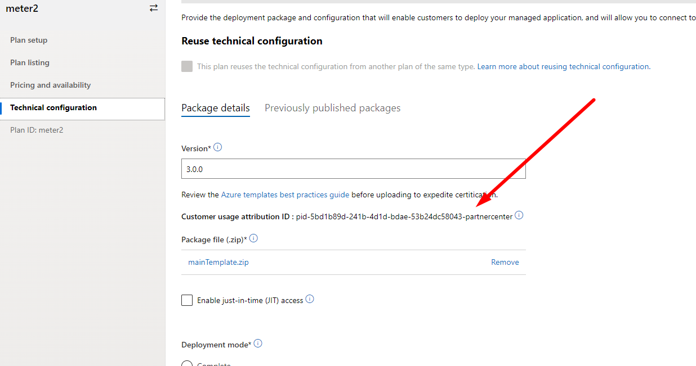

# Deploy  Azure Marketplace Managed-App with built-in Custom billing Meter Using HTTP POST Request:

This demo shows how to deploy Managed App with Function app to  emit meter usage events to marketplace using http trigger and request body.

## Design
The following diagram shows the overall workflow for this demo


## Custom billing Senario

This demo shows how to implement a custom billing using Azure http trigger function where usage information will be passed on request body.
For this demo, we setup plan information as following


The Azure function will expect body as following
```
{
    "dimension" : "key",
    "quantity"  : 1
}
```


## Important Configuration
ARM template expects the following configuration
1. <b>Variable artifacts:</b> ARM template will deploy function from a Zip file. This variable is used to reference to the location of the zip file
1. ARM using resource type `Microsoft.Resources/deployments` 

In order to pass the Partner center validation you need to update the resource name with the Customer PID Guid from PartnerCenter


1. ARM Template will deploy function using `WEBSITE_RUN_FROM_PACKAGE` and expecting `functionpackage.zip` to place under `artifacts` folder.


## Installation from Partner Center Preview

1. Use the contents of the `/function/ama-custom-billing-msi-trigger-with-request-body/arm` folder to create a ZIP file for your plan in Partner Center.
1. Upload the ZIP file to the Technical Configuration page of the Azure Managed Application plan in Partner Center.
1. Publish the plan. It will take some time for the plan to reach Preview stage.
1. From Preview, purchase the plan. 
    - Do not purchase the plan from the same Azure Tenant as the one used to publish the plan. If you do so, the script referenced later will error.
    

## Usage from the Managed Application

1. After deployment is complete, open **managed resource group** 
1. Open function app and Click **Functions**
1. Click Webhook  and Click **Code + Test** to then click **Test/Run**

1. In the Testing Panel, Under **Body** Section, add the following 
```
{
  "dimension": "key",
  "quantity" : 1
}
```


1. Click **Run** and you should see the following successful emitting event


